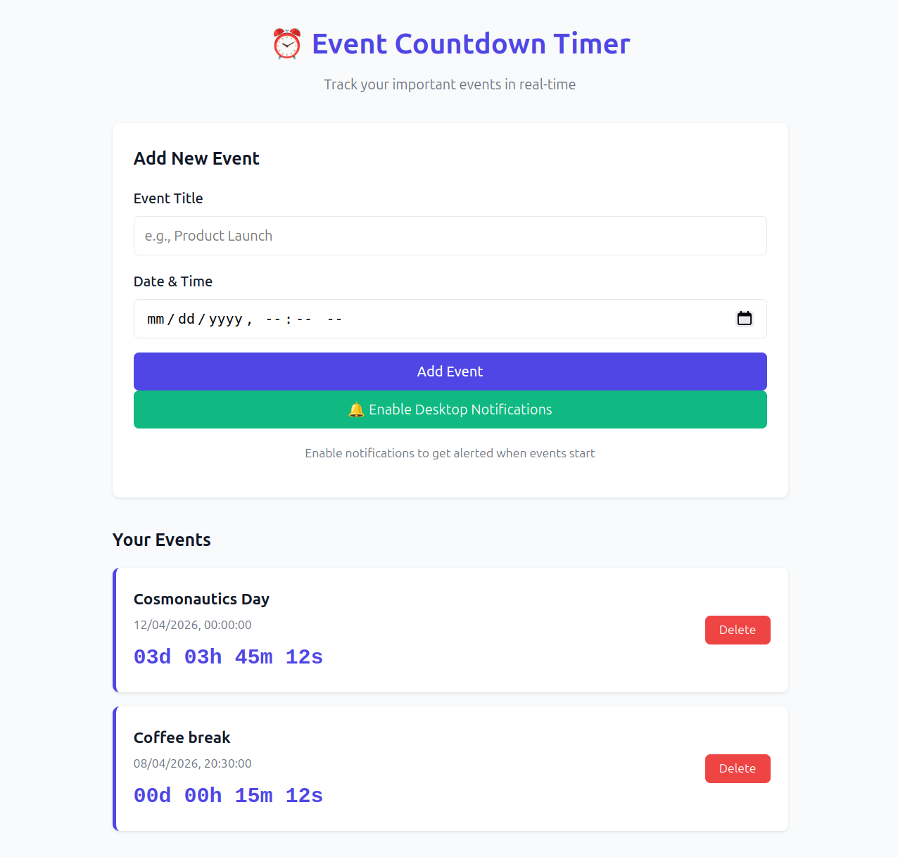

# Event Countdown Timer

A real-time event countdown timer with desktop notifications, built with FastAPI and vanilla JavaScript.

## Product Definition

| Item | Description |
|------|-------------|
| **End-User** | Students, professionals, anyone who tracks deadlines and events |
| **Problem** | People miss important events because they forget to check calendars or don't get timely reminders |
| **One-Liner** | "A web page where you add events, watch live countdowns, and get desktop notifications when they arrive" |
| **Core Feature** | Real-time live countdown display (days/hours/minutes/seconds) with automatic desktop notifications |

## Features

### Version 1 - Core MVP
- ✅ Add events with title and target date/time
- ✅ Real-time countdown display (days, hours, minutes, seconds)
- ✅ Delete events
- ✅ Persistent storage with SQLite
- ✅ Clean, responsive UI

### Version 2 - Notifications & Polish
- ✅ Desktop push notifications when events start
- ✅ Background scheduler for reliable notification delivery
- ✅ Visual state changes as events approach (color shifts)
- ✅ Server-client time synchronization
- ✅ Responsive design for mobile/desktop
- ✅ Notification state tracking in database
- ✅ **User session isolation** - Each user only sees and manages their own events via session-based filtering


## Tech Stack

| Component | Technology |
|-----------|------------|
| Backend | Python + FastAPI |
| Database | SQLite |
| Scheduler | APScheduler |
| Frontend | Vanilla HTML/CSS/JS |

## Installation

1. **Install Python dependencies:**
   ```bash
   pip install -r requirements.txt
   ```

2. **Configure environment (optional):**
   ```bash
   cp .env.example .env
   ```
   Edit `.env` to customize host, port, or database path.

## Running the Application

Start the FastAPI server:

```bash
uvicorn main:app --reload --host 127.0.0.1 --port 8000
```

The app will be available at: **http://localhost:8000**

## Demo



*The main interface showing event creation, live countdowns, and desktop notification controls.*

## Usage

1. Open http://localhost:8000 in your browser
2. (Optional) Click "Enable Desktop Notifications" to allow browser notifications
3. Add an event:
   - Enter an event title
   - Select a future date and time
   - Click "Add Event"
4. Watch the live countdown timer
5. Get notified when the event starts!

## Deployment

### Target Environment

| Item | Requirement |
|------|-------------|
| **OS** | Ubuntu 24.04 LTS (or any Linux distribution with Python 3.10+) |
| **Architecture** | x86_64 / ARM64 |

### Prerequisites

Ensure the following are installed on the VM:

- **Python 3.10+** — `sudo apt install python3 python3-pip python3-venv`
- **Git** — `sudo apt install git`
- **(Optional) Docker & Docker Compose** — for containerised deployment

### Option A — Manual Deployment (pip)

1. **Clone the repository:**
   ```bash
   git clone https://github.com/<your-username>/se-toolkit-hackathon.git
   cd se-toolkit-hackathon
   ```

2. **Create and activate a virtual environment:**
   ```bash
   python3 -m venv venv
   source venv/bin/activate
   ```

3. **Install dependencies:**
   ```bash
   pip install -r requirements.txt
   ```

4. **Configure environment (optional):**
   ```bash
   cp .env.example .env
   ```
   Edit `.env` to customise host, port, or database path.

5. **Start the application:**
   ```bash
   uvicorn main:app --host 0.0.0.0 --port 8000
   ```

6. **(Optional) Run as a systemd service for production:**
   Create `/etc/systemd/system/event-timer.service`:
   ```ini
   [Unit]
   Description=Event Countdown Timer
   After=network.target

   [Service]
   Type=simple
   User=ubuntu
   WorkingDirectory=/home/ubuntu/se-toolkit-hackathon
   ExecStart=/home/ubuntu/se-toolkit-hackathon/venv/bin/uvicorn main:app --host 0.0.0.0 --port 8000
   Restart=always

   [Install]
   WantedBy=multi-user.target
   ```
   Then enable and start:
   ```bash
   sudo systemctl daemon-reload
   sudo systemctl enable --now event-timer
   ```

### Option B — Docker Deployment

1. **Clone the repository:**
   ```bash
   git clone https://github.com/<your-username>/se-toolkit-hackathon.git
   cd se-toolkit-hackathon
   ```

2. **Build and run with Docker Compose:**
   ```bash
   docker compose up -d --build
   ```

   Or with plain Docker:
   ```bash
   docker build -t event-countdown-timer .
   docker run -d -p 8000:8000 --name event-timer event-countdown-timer
   ```

3. **Verify the container is running:**
   ```bash
   docker ps
   ```

### Post-Deployment

The app will be accessible at **http://&lt;vm-ip&gt;:8000**. If you place it behind a reverse proxy (e.g., Nginx), configure it to forward traffic to port 8000.

## API Endpoints

| Method | Endpoint | Description |
|--------|----------|-------------|
| GET | `/` | Serve the main page |
| GET | `/server-time` | Get current server time (UTC) |
| GET | `/events` | List all events (optionally filtered by `user_session_id` query param) |
| POST | `/events` | Create a new event |
| GET | `/events/{id}` | Get event by ID |
| DELETE | `/events/{id}` | Delete an event (optionally requires `user_session_id` for authorization) |

### Request/Response Examples

**Create Event:**
```json
POST /events
{
  "title": "Product Launch",
  "target_datetime": "2026-04-08T15:30:00"
}
```

**Response:**
```json
{
  "id": 1,
  "title": "Product Launch",
  "target_datetime": "2026-04-08T15:30:00",
  "created_at": "2026-04-08T10:00:00",
  "user_session_id": "session_abc123",
  "notified": false
}
```

## Demo Script (3 minutes)

1. Start the application and open http://localhost:8000
2. Enable desktop notifications when prompted
3. Add an event 3 minutes in the future
4. Show the countdown timer ticking down
5. Wait for the notification to fire at exactly 00:00:00
6. Demonstrate event deletion and page refresh persistence

## Project Structure

```
se-toolkit-hackathon/
├── main.py              # FastAPI application and routes
├── database.py          # SQLite database operations
├── scheduler.py         # APScheduler background tasks
├── requirements.txt     # Python dependencies
├── events.db           # SQLite database (auto-created)
├── static/
│   ├── index.html      # Main HTML page
│   ├── style.css       # Styles
│   └── app.js          # Frontend JavaScript
├── .env.example        # Environment template
└── README.md           # This file
```

## License

MIT License - see LICENSE file for details.
